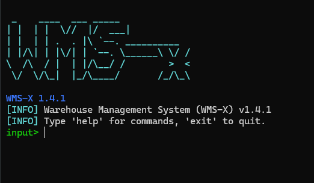

#  WMS-X — Warehouse Management System (C++ CLI Edition)

A **modular**, **high-performance** Warehouse Management System built in **modern C++17**, designed with clean architecture, real-world logistics workflows, and future scalability in mind.

> **Production-Ready Core** — Engineered to serve as a backend foundation for **CLI**, **GUI**, **REST API**, and enterprise integrations — *without refactoring business logic*.


---

##  Key Features

| Feature | Preview |
|--------|---------|
| **Inventory Management** — Add, update, delete, search and list items with validation |  |
| **Persistent Storage** — JSON-backed persistence (`inventory_data.json`) with automatic load/save |  |
| **Receipt System** — Generate timestamped transaction receipts (e.g., for audits) |  |
| **Command Architecture** — Extensible CLI command system via registration |  |
| **Modular Core** — Strict separation: domain → controllers → storage → interface |  |
| **CMake Build** — Cross-platform Windows / Linux / macOS |  |
| **Future-Proof** — Qt GUI, REST API, Web Dashboard ready |  |

---

##  Architecture Overview

```
CLI  ──▶  Command System  ──▶  Controllers  ──▶  Inventory Engine
                                 │
                                 ├── Storage (JSON Persistence)
                                 ├── Receipt Engine
                                 └── Domain Models (Item, Inventory)
```

---

##  Requirements

| Tool | Version |
|------|--------|
| C++ Compiler | GCC / Clang / MSVC (C++17+) |
| CMake | 3.10+ |
| Git | Latest |

---

##  CLI Usage

| Command | Action |
|--------|--------|
| `add` | Add new inventory item |
| `list` | Display all items |
| `remove` | Delete item |
| `update` | Modify item details |
| `receipt` | Generate transaction receipt |
| `exit` | Close application |

---

##  Building process (MSYS / MinGW)

```bash
g++ -std=c++17 -O0 -g -Wall -Wextra -Icore core/*.cpp cli.cpp -o wms.exe
```

---

##  Roadmap

| Phase | Feature |
|------|--------|
| Phase 1 | CLI Core (Done) |
| Phase 2 | SQLite backend (JSON persistence implemented) (Done) |
| Phase 3 | Qt GUI Front-End (Current plan) |
| Phase 4 | REST API (Crow / Pistache) |
| Phase 5 | Web Dashboard |

---

###  Author

**Rayan (Fally)**  
Cybersecurity Student • Systems Engineer • Builder of unnecessarily powerful tools
