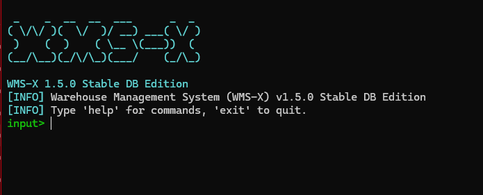

#  WMS-X — Warehouse Management System (C++ CLI Edition)

A **modular**, **high-performance** Warehouse Management System built in **modern C++17**, designed with clean architecture, real-world logistics workflows, and future scalability in mind.

> **Production-Ready Core** — Engineered to serve as a backend foundation for **CLI**, **GUI**, **REST API**, and enterprise integrations — *without refactoring business logic*.


---

##  Key Features

| Feature | Preview |
|--------|---------|
| **Inventory Management** — Add, update, delete, search and list items with validation |  |
| **Persistent Storage** — SQLite-backed persistence with automatic load/save |  |
| **Receipt System** — Generate timestamped transaction receipts (e.g., for audits) |  |
| **Command Architecture** — Extensible CLI command system via registration |  |
| **Modular Core** — Strict separation: domain → controllers → storage → interface |  |
| **Cross-Platform** — Windows / Linux / macOS via g++ / clang / MSVC |  |
| **Future-Proof** — Qt GUI, REST API, Web Dashboard ready |  |

---

##  Architecture Overview

```
CLI  ──▶  Command System  ──▶  Controllers  ──▶  Inventory Engine
                                 │
                                 ├── Storage (SQLite Persistence)
                                 ├── Receipt Engine
                                 └── Domain Models (Item, Inventory)
```

---

##  Project Structure

```
WMS-Cpp/
├── src/
│   ├── main.cpp                  # Entry point & REPL loop
│   ├── models/
│   │   ├── Item.h / Item.cpp           # Domain model — item entity
│   │   └── Inventory.h / Inventory.cpp # In-memory inventory + SQLite sync
│   ├── storage/
│   │   ├── Storage.h / Storage.cpp     # SQLite database wrapper
│   │   └── Receipt.h / Receipt.cpp     # Receipt generation & persistence
│   ├── controllers/
│   │   └── WmsControllers.h / .cpp     # Business logic & task queue
│   ├── commands/
│   │   ├── command.hpp                 # ICommand interface
│   │   ├── addComand.hpp               # All command implementations
│   │   ├── CommandContext.hpp          # Execution context struct
│   │   └── registry.hpp               # Command registry
│   ├── cli/
│   │   ├── cli.h / cli.cpp            # CLI argument parser
│   ├── output/
│   │   └── output.h / output.cpp      # Formatted output & color support
│   └── utils/
│       ├── results.hpp                 # Result<T> type
│       ├── safetyparse.hpp             # Safe integer parsing
│       └── parser.hpp                  # Input tokenizer
├── vendor/
│   └── SQLiteCpp/                      # SQLite C++ wrapper (vendored)
├── assest/                             # Screenshots & logo
├── .github/
│   └── workflows/c-cpp.yml            # CI build workflow
├── .gitignore
└── README.md
```

---

##  Requirements

| Tool | Version |
|------|--------|
| C++ Compiler | GCC / Clang / MSVC (C++17+) |
| SQLite3 | Development library (`libsqlite3-dev` or equivalent) |
| Git | Latest |

---

##  CLI Usage

| Command | Action |
|--------|--------|
| `add` | Add new inventory item |
| `list` | Display all items |
| `remove` | Delete item |
| `update` | Modify item details |
| `search` | Find item by ID or name |
| `queue` | Queue a task (ADD/REMOVE/LIST/SEARCH) |
| `runq` | Process queued tasks |
| `receipt` | Generate transaction receipt |
| `help` | Show available commands |
| `exit` | Close application |

---

##  Building (MSYS2 / MinGW)

```bash
g++ -std=c++17 -O0 -g -Wall -Wextra \
  -Isrc -Ivendor/SQLiteCpp/include \
  src/main.cpp \
  src/models/Item.cpp src/models/Inventory.cpp \
  src/storage/Storage.cpp src/storage/Receipt.cpp \
  src/controllers/WmsControllers.cpp \
  src/output/output.cpp src/cli/cli.cpp \
  vendor/SQLiteCpp/src/*.cpp \
  -lsqlite3 -o wms.exe
```

---

##  Roadmap

| Phase | Feature |
|------|--------|
| Phase 1 | CLI Core ✅ |
| Phase 2 | SQLite Backend ✅ |
| Phase 3 | Qt GUI Front-End (Current plan) |
| Phase 4 | REST API (Crow / Pistache) |
| Phase 5 | Web Dashboard |

---

###  Author

**Rayan (Fally)**  
Cybersecurity Student • Systems Engineer • Builder of unnecessarily powerful tools
